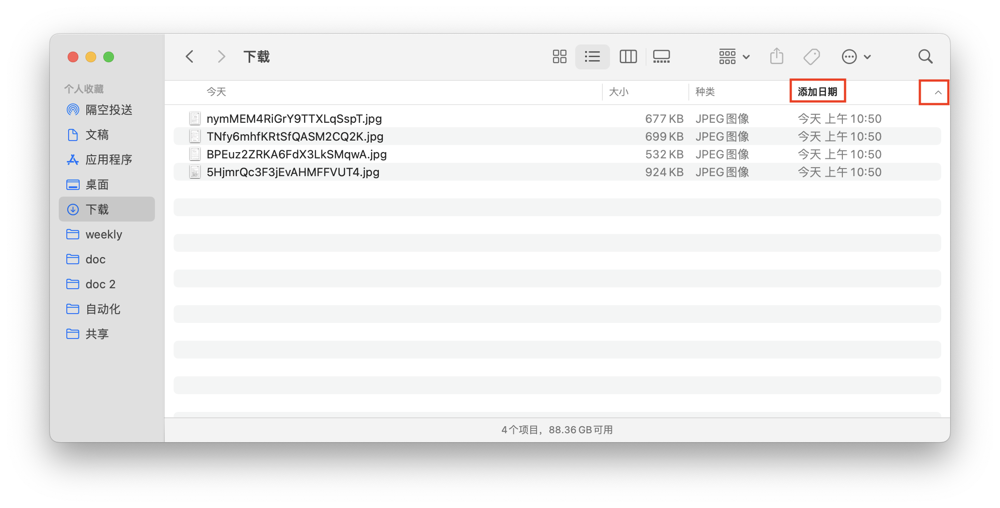

# 说明书
- 背景：线上作业下载后，按时间排序仍是乱序的，与作业原来的顺序不一致
- 用此插件下载，按时间排序，顺序正确 ✅

## 适用页面
- 网址开头是这个：`https://mapi.yuanfudao.com/evaluation/#/admin/evaluation/homework-correct-viewing/...`

- 例子：`https://mapi.yuanfudao.com/evaluation/#/admin/evaluation/homework-correct-viewing/3752208/2117085`

## 安装
1. 复制这个网址 `chrome://extensions/` ，用谷歌浏览器打开
2. 开启“开发者模式”
3. 点击“加载已解压的扩展程序”
4. 选择文件夹：`图片顺序下载插件`

## 使用
1. 自动识别可用网站，并出现悬浮下载按钮
- 
2. 下载后，按“添加日期”排序，顺序正确 ✅

## 下载规则
- 默认下载到系统下载目录
- 文件名使用图片 ID（如 `SDtvqonFcyzxrXrqnQNSf2.jpg`）

## 说明
- 插件优先通过接口提取顺序，失败时回退到页面 DOM 提取
- 为提升速度，下载采用“快速顺序触发”模式（不是逐张等待完成再下载）
