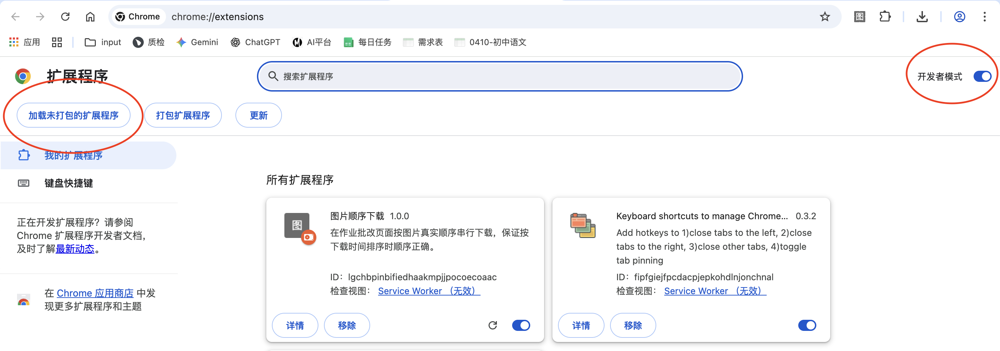
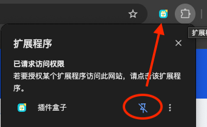
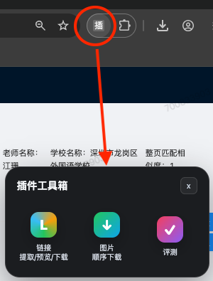
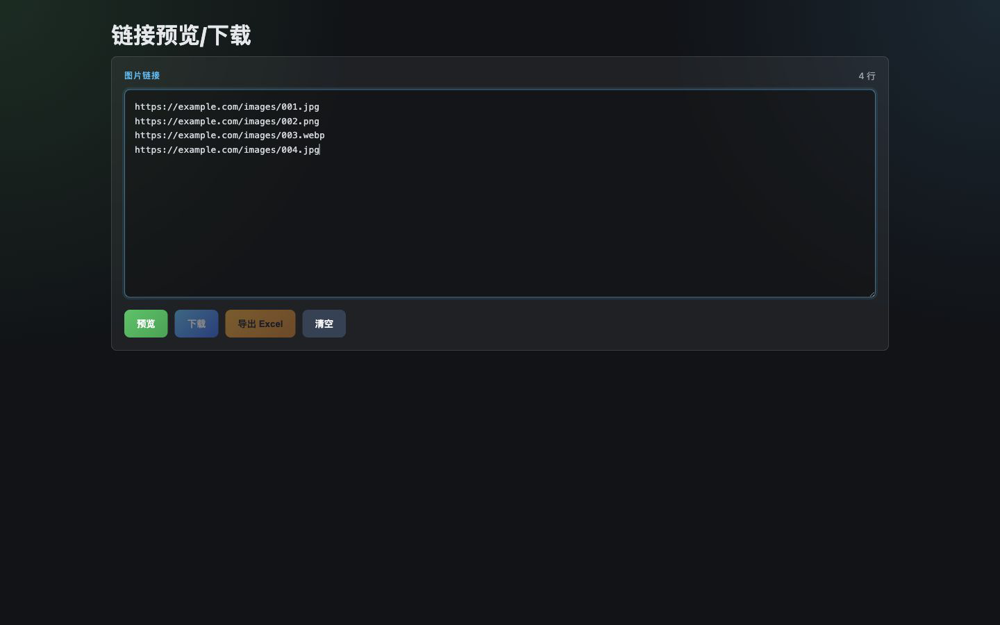
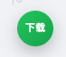

# 插件盒子

一个 Chrome 插件盒子，适用于Mac/Win，统一包含：

- 链接预览/下载
- 顺序下载（线上作业）
- 评测
- 字框标注
- 周报工具

## 安装

1. 复制这个网址 `chrome://extensions/`，用谷歌浏览器打开。
2. 开启“开发者模式”。
3. 点击“加载已解压的扩展程序”。
4. 选择文件夹：`插件盒子`。

## 使用

- 点小图钉📌，固定扩展图标，使用更方便

  

- 点击浏览器右上角“插件盒子”扩展图标，呼出或关闭主界面。

  

- 点主界面上的小工具，呼出/隐藏 该小工具的按钮

## 小工具

### 1. 链接预览/下载

- 每行粘贴一个图片链接，可预览、下载或导出链接列表。

### 2. 顺序下载（线上作业）

- 适用于线上作业，网址开头是这个：
    `https://mapi.yuanfudao.com/evaluation/#/admin/evaluation/homework-correct-viewing/...`
- 例子：`https://mapi.yuanfudao.com/evaluation/#/admin/evaluation/homework-correct-viewing/3752208/2117085`
- 进入符合条件的页面后，默认自动显示“下载”按钮；其他网站不能呼出。
- 背景：线上作业下载后，按时间排序仍是乱序的，与作业原来的顺序不一致。
- 点“下载”按钮下载，按时间排序，顺序正确。

  

下载后，按“添加日期”排序，顺序正确。

### 3. 评测

支持一键自动化评测：
- `固定&AI混合`
- `分数&AI混合`
- `答题卡`

仅支持生产或 `online-venv` 环境中的 `holepage`、`cardPage` 评测详情页。进入符合条件的页面后，默认自动显示“评测”按钮；其他网站不能呼出。

呼出评测按钮后，选择评测项并点击“开始评测”。完成提示会显示在页面右下角。

- 可以 `全部勾选` ：如下图，可以全部勾选所有tab
- 执行时会 `自动跳过` 页面上没有的，不影响评测结果

### 4. 字框标注

- 适用于：
  `https://metis-aione-test.zhenguanyu.com/metis-aione-eval/samples/...`
- 默认隐藏；点击插件盒子里的“字框标注”可呼出或隐藏界面。
- 支持单击画固定尺寸字框、自动跳过标点、正向/反向自动选字、连续删除 5 个字框、清空标点字框、清空全部字框。
- 默认处于“暂停助手”，不会影响页面原有拖拽、选择和移动字框。
- 所有操作只修改当前未保存草稿，永久写回仍需点击页面原有的“保存标注”。

### 5. 周报工具

点击“周报工具”打开独立统计页面。
