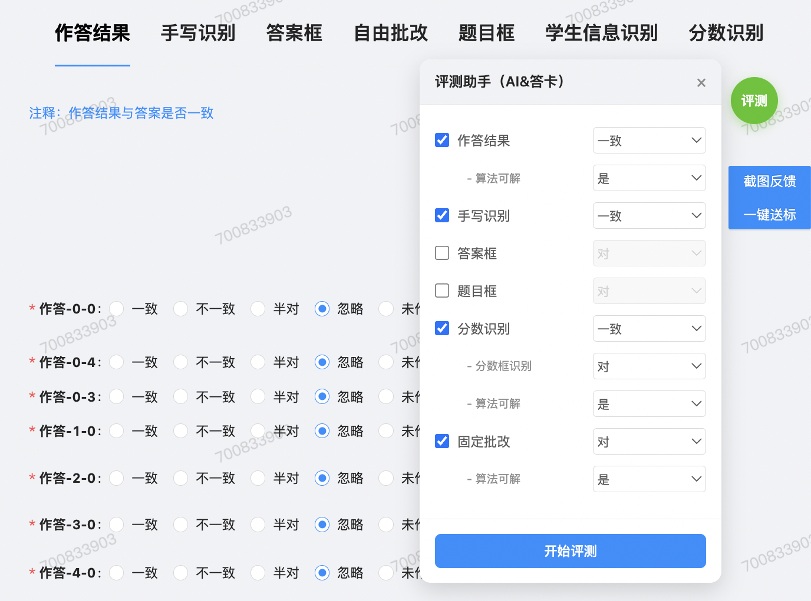
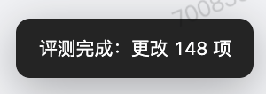
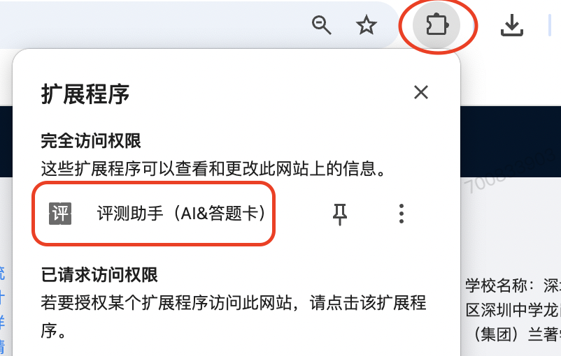
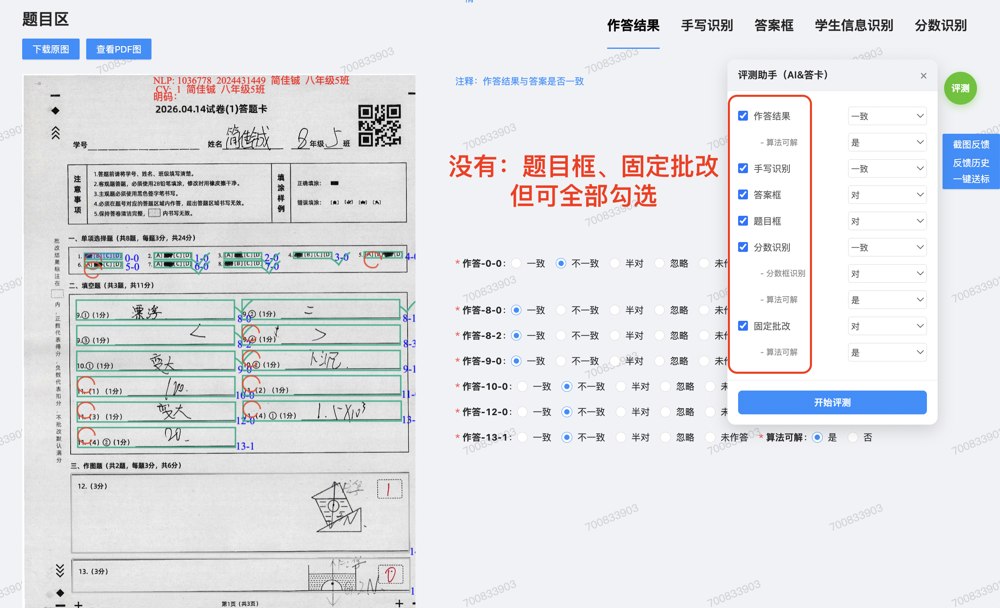

# 说明书

## 简介
支持一键自动化评测：
- `固定&AI混合`
- `分数&AI混合`
- `答题卡`

## 安装
1. 复制这个网址 `chrome://extensions/` ，用谷歌浏览器打开
2. 开启“开发者模式”
3. 点击“加载已解压的扩展程序”
4. 选择文件夹：`评测助手（AI&答题卡）`

## 使用
1. 自动识别`日常AI、答题卡评测` 的网站，并出现悬浮 `评测` 按钮

  

2. 按需勾选，点 `开始评测`，等待完成
3. 完成后，会有提示
- 

## 手动呼出 `评测` 按钮
按照下图点击，可手动呼出 `评测` 按钮
- 适用于临时的评测任务，没有自动出现悬浮 `评测` 按钮的

  

## tips
- 可以 `全部勾选` ：如下图，可以全部勾选所有tab
- 执行时会 `自动跳过` 页面上没有的，不影响评测结果
- 
